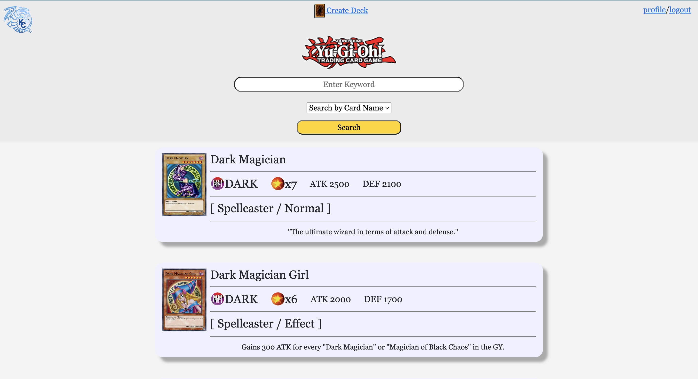
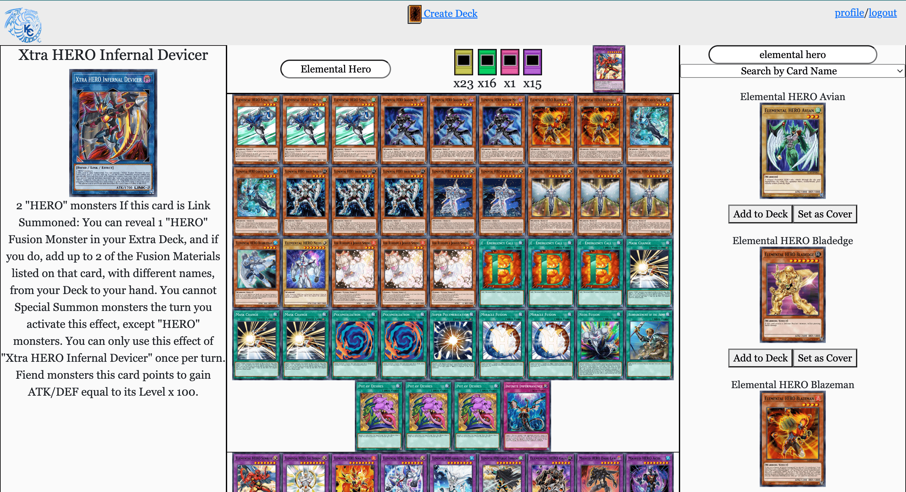
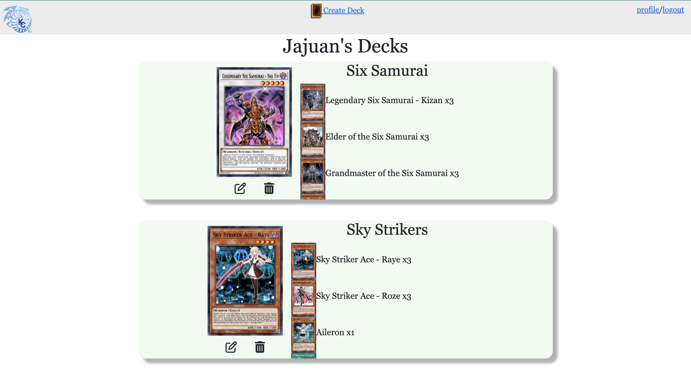

# Yu-Gi-Oh Deck Builder

# Visit Website
Deployed Website: https://ygodeckbuilderjg.netlify.app/ 

# Project Description
A full CRUD web application that let's you look up Yugioh cards in our database and create deck.

# Technology USed
-HTML   
-CSS  
-Bootstrap  
-Javascript  
-Typescript  
-Firebase  
-YGO-API  

# Card Database  
Users can look up cards by their name, what archetype they belong to, or by their card text.  
  
  
# Deck Building  
Users can build decks and have their decks save to our Firebase database.  
  
  
# Profile  
Users can go to their profile to view their decks, edit their existing decks, and delete the decks they own.  

